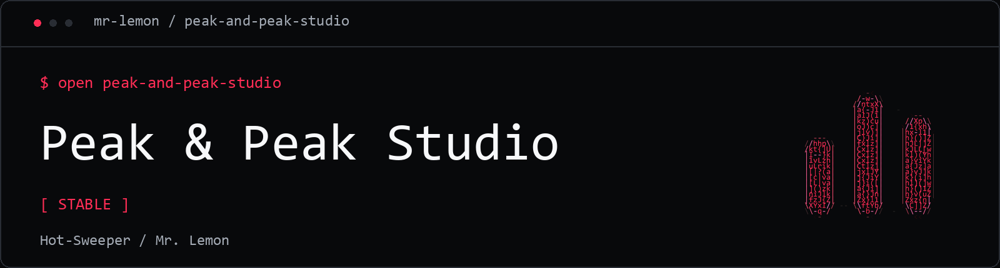

<picture>
  <source media="(max-width: 600px)" srcset=".github/assets/banner-mobile.png">
  
</picture>

# Peak & Peak Studio

**Stable** · A browser-based audio effects studio. Load a track, shape its sound, and export a WAV file. Audio processing happens on your device; your tracks are not uploaded to a server.

[](#use-the-studio)
[](package.json)
[](src/lib/audio/engine.ts)

## Highlights

- Slowed playback and reverb controls
- Bass boost and pitch controls
- Waveform visualization and playback controls
- A local track library backed by IndexedDB
- WAV export using browser audio processing
- No account or audio upload required

## Use the studio

1. Open the app and go to `/studio`.
2. Choose an audio file your browser can decode.
3. Adjust speed, reverb, bass boost, and pitch.
4. Play your track, then use **Export Master** to save a WAV file.

Your browser's audio support determines which file formats it can open. The library is stored locally in that browser; clearing site data removes the stored library.

## Run locally

Requirements: Node.js 20.9 or newer, npm, and Git.

```bash
git clone https://github.com/Hot-Sweeper/peak-and-peak-studio.git
cd peak-and-peak-studio
npm ci
npm run dev
```

Open [localhost:3000](http://localhost:3000), then choose **Open Studio**.

## Production build

```bash
npm run build
npm start
```

The repository includes Railway configuration for building and running the app. No API keys or secrets are needed for its client-side audio workflow.

## Stack

TypeScript · React · Next.js · Tailwind CSS · Web Audio API · Zustand · IndexedDB

## Project structure

```text
src/app/           Landing page and studio
src/components/    Audio controls, waveform, library, and layout
src/lib/audio/     Playback, effects, and background audio
src/lib/db/        Local library storage
src/stores/        Audio and library state
```

## Feedback

Report bugs or suggest improvements through [GitHub Issues](https://github.com/Hot-Sweeper/peak-and-peak-studio/issues). Include your browser, operating system, and steps to reproduce the issue.

---

Built by [Mr. Lemon / Hot-Sweeper](https://github.com/Hot-Sweeper) · [Still Browser — experimental alpha](https://github.com/Hot-Sweeper/still-browser) · [Branding](https://github.com/Hot-Sweeper/Hot-Sweeper/blob/main/BRANDING.md)
